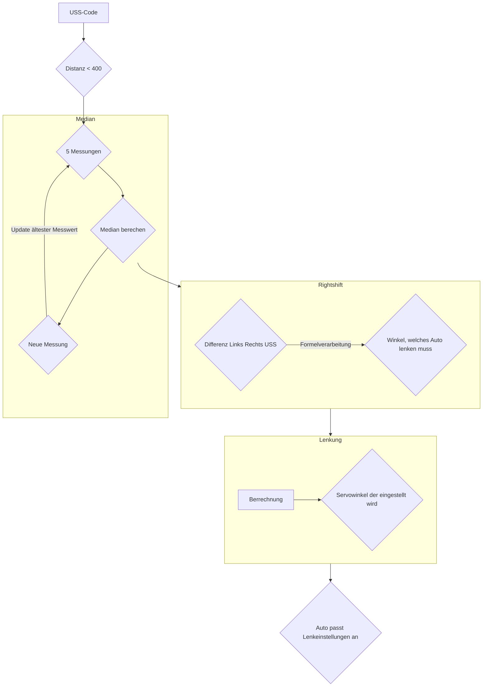
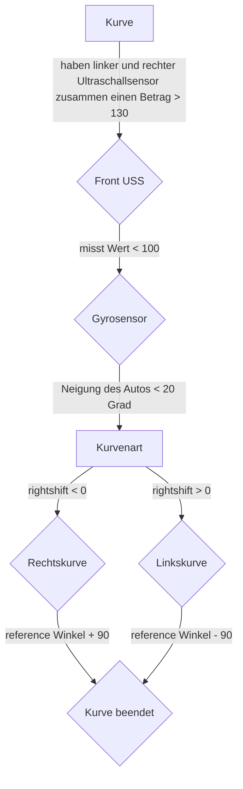

# Eröffnungsrennen
Beim Eröffnungsrennen bezieht das Auto Ultraschall - und Gyrosensordaten um in der Mitte zwischen den aufgestellten banden fährt. Befindet es sich nicht mittig, z.B. wegen einer Kurve, wird ein neuer Winkel ausgerechnet, der angestrebt werden soll. Dieser wird dann langsam korrigiert um eine ruckartige bewegung zu verhindern und darf zudem eine maximale größe nicht überschreiten, welcher durch den Gyrosensor definiert wird. Dieser zählt zudem die zurückgelegten Kurven, um nach drei Runden zu stoppen.
## Flowchart für die Ultraschallsensoren

## Flowchart für die Kurvenlogik

