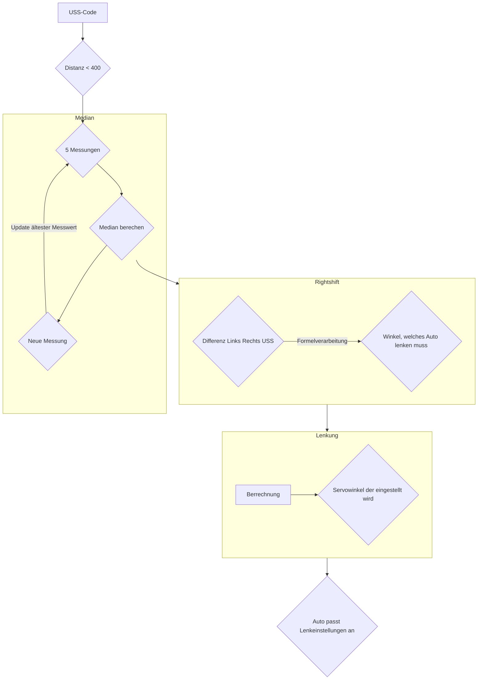
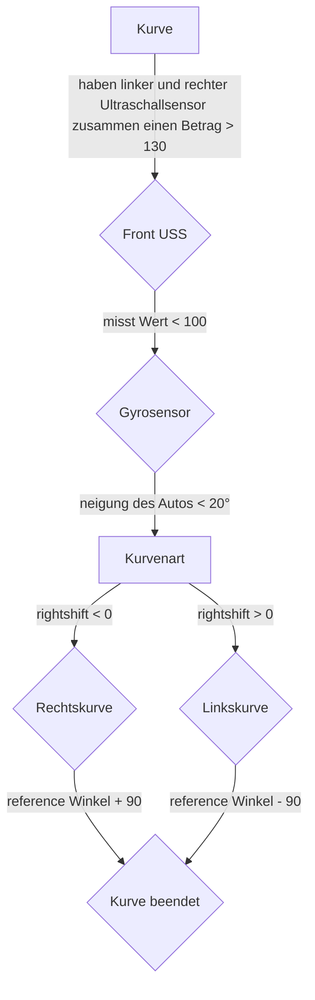
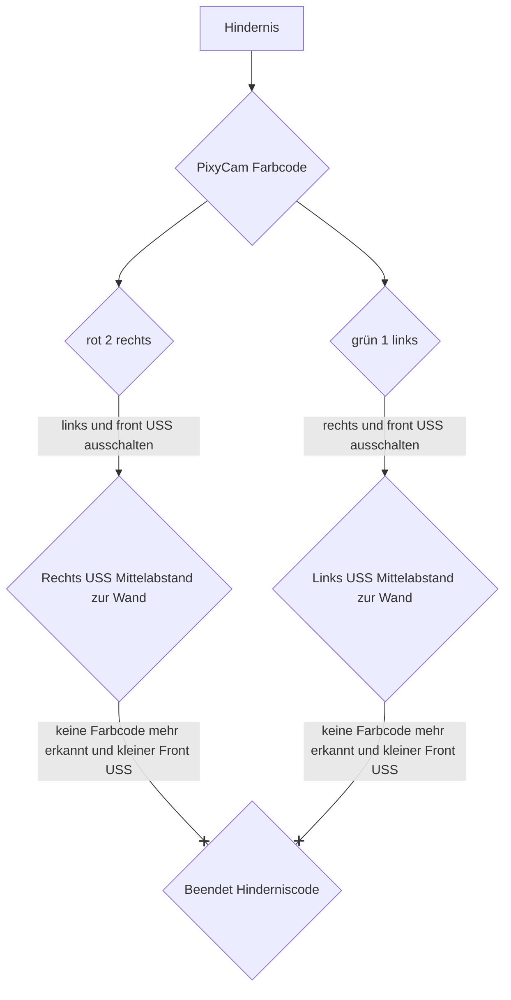

# Gesamtes Rennen
Das Programm beinhaltet einen Parameter, der bestimmt, ob allein die Teile des Programms verwendet werden müssen, die für das Eröffnungsrennen wichtig sind, da dieses kein Kamera Script, sondern allein die Ultraschallsensoren benötigt, oder auch die Kameradaten verwendet werden müssen.

## Flowchart für die Ultraschallsensoren

Beim Eröffnungsrennen bezeiht das Auto Ultraschall - und Gyrosensordaten um in der Mitte zwischen den aufgestellten banden fährt. Befindet es sich nicht mittig, z.B. wegen einer Kurve, wird ein neuer Winkel ausgerechnet, der angestrebt werden soll. Dieser wird dann langsam korrigiert um eine ruckartige bewegung zu verhindern und darf zudem eine maximale größe nicht überschreiten, welcher durch den Gyrosensor definiert wird. Dieser zählt zudem die zurückgelegten Kurven, um nach drei Runden zu stoppen. 
## Flowchart für die Kurvenlogik

## Flowchart für das Hindernisrennen


## Complete_V1.ino
Gestartet wird das Programm über das Complete_V1.ino, welches alle weiteren Klassen öffnet und managed.
```c++
//Inkludieren der erforderlichen Bibliotheken und Verwendung der Header Datein
#include "variables.h"  // all the vars, actuators, and sensors are defined and initialized here.
#include "ControlRC.h"  // all functions for control, read sonsor and update variables are located here


//serielle Verbindung erstellen und die Ports des Arduino aus dem Variable Header initialisieren
void setup() {
  Serial.begin(9600);
  while (!Serial) delay(10);

  initializeHardware();
}


unsigned long stopTime = 0;  // um zu wisen, wann gestoppt werden muss

//  Anweisungen für das Auto
void loop() {

  updateControlData();
  drivingDC.drive(velocity); // Grundgeschwindigkeit des DC Motors
  control_servo();
  
  //print(); // Debugging

  //Abbruchbedingung nachdem 3 Runden gefahren wurden
  if (stop && stopTime == 0) {
    stopTime = millis() + secs * 1000;  // weiterfahren für 3 weitere Sekunden
  }

  if (stopTime > 0 && millis() >= stopTime) {
    while (1) {
      control_servo();//steeringservo.drive?
      drivingDC.drive(0);
      delay(100);
    }
  }
}


// verschiedenen Sensordaten im Seriellen Monitor für Bugfixing und Verständnis von dem, was der Roboter tut
void print() {
  //manager.printDistances();
  Serial.print("referenceAngle ");
  Serial.print(referenceAngle);
  Serial.print("       rightShift ");
  Serial.print(rightShift);
  Serial.print("       right ");
  Serial.print(distances[1]);
  Serial.print("       left ");
  Serial.print(distances[2]);
  Serial.print("       front ");
  Serial.print(distances[0]);
  Serial.print("       roll ");
  Serial.print(roll);
  Serial.print("       targetAngle ");
Serial.print(controlDataArr[0] - referenceAngle);
   Serial.print("       width ");
  Serial.print(cam.get_width());
    Serial.print("       color ");
 Serial.println(cam.get_color());
}

```

## ControlRC.h
Diese Header Datei enthält sämtliche Logik für das Auto und sorgt dafür dass die Messwerte zum richtigen Zeitpunkt aktualisiert und berechnet werden. Durch diese Logik werden dann die neuen Geschwindigkeiten und Anpassungen der Lenkungen weitergegeben.

```c++
//Inkludieren der erforderlichen Bibliotheken.
#ifndef Control_h
#define Control_h
#import <math.h>
#include "variables.h"

// Überprüfung, ob der Referenzwinkel in einem sicheren Berreich liegt, sodass dabei die Ultraschall-Sensoren sichere Werte verwenden
void checkSafeAngle() {
  if (abs(referenceAngle - roll) <= 12) {
    safeAngle = true;
  } else {
    safeAngle = false;
  }
}

//  Untersuchung durch die Ultraschall-Sensoren, ob eine Kurve detektiert wird
void checkCurve() {
  if (distances[2] + distances[1] >= 130) {
    if (distances[0] < 110 && cam.getX_pos() >=5) {
      if (safeAngle) {
        cam.set_color();
        if (distances[2] - distances[1] > 20) {
          referenceAngle -= 90;
        } else if (distances[2] - distances[1] < -20) {
          referenceAngle += 90;
        }
      }
    }
  }
}
// Untersuchung durch die Gyrosensoren, ob der Auto sich bereits 3*360° gedreht hat, dann Auto stoppen
void stopCheck() {
  /*if (referenceAngle > 0)
    secs = 2.7;
  else
    secs = 3.5;*/
  int numberOfRounds = 3;
  if (abs(referenceAngle) >= numberOfRounds * 360 - 20)
    stop = true;
  else
    stop = false;
}
// neue Gyro-Sensordaten
void updateSensorData() {
  manager.readDistances(distances);
  roll = orientation.getTotalRoll();
}

// neue Kameradaten
void updateCameraData() {
  cam.firstBlockData();
  color = cam.get_color() * Run;
}

// Führt vorherige Funktionen aus
void updateChecks() {
  checkSafeAngle();
  checkCurve();
  stopCheck();
}
// wird durch RC_Control.ino gestartet und startet andere Funktionen, berechnet die verschiedenen Winkel und Anpassungen
void updateControlData() {
  updateChecks();
  updateSensorData();
  updateCameraData();
  int frontDistance = distances[0];
  int rightDistance = distances[1];
  int leftDistance = distances[2];

  //berechnet Richtgeschwindigkeit

  const float FACTOR = 1.0f;     // 2
  const float FACTOR2 = 0.005f;  //0.01
  float target_velocity = frontDistance * FACTOR * tanh(frontDistance * FACTOR2);

  //berechnet Steuerwinkel

  const float FACTOR_Steering = 5.0f * 0.8;//5
  const float wandAbstand = 7.0f;
  //const float FACTOR_Camera = 10.0f; ?

  // Calcualte relative lateral position on the road
  // (how far towards right border is the cart located)
  // + Kamera erklären
  rightShift = (leftDistance - wandAbstand) * abs(max(-1, color - 2)) - (rightDistance - wandAbstand) * abs(color - 1);

  // The closer the cart is to the right border, the more it should steer to the left (and vice versa).
  // (Steering to the right = positive steering angle)
  // To achieve this in a smooth way, a parameter-tuned tanh function can be used.

 float target_car_angle = -1 * (FACTOR_Steering / (abs(min(0, color - 1)) * min(frontDistance, 40) + min(1, color) * 5)) * rightShift * tanh(abs(rightShift)) + referenceAngle;
   
  if (cam.get_blocks() * Run) {
    target_car_angle = (target_car_angle >= referenceAngle + 50 ? referenceAngle + 50 : target_car_angle);
    target_car_angle = (target_car_angle <= referenceAngle - 50 ? referenceAngle - 50 : target_car_angle);
  } else if (abs(roll - referenceAngle) > 30) {
    target_car_angle = (target_car_angle <= referenceAngle - 35 ? referenceAngle - 35 : target_car_angle);
    target_car_angle = (target_car_angle >= referenceAngle + 35 ? referenceAngle + 35 : target_car_angle);
  } else {
    target_car_angle = (target_car_angle <= referenceAngle - 5 ? referenceAngle - 5 : target_car_angle);
    target_car_angle = (target_car_angle >= referenceAngle + 5 ? referenceAngle + 5 : target_car_angle);
  }
  controlDataArr[0] = target_car_angle;
  controlDataArr[1] = target_velocity;
  lastShift = rightShift;
  //if (abs(rightShift) < 5)
  //velocity = 50;
}

// Weiterleiten der berechneten Daten zum Servo, passt damit die Lenkung an
void control_servo() {
  float target_car_angle = controlDataArr[0];
  float err = target_car_angle - roll;
  steeringServo.drive(err * 0.1);  // 0.1 Eröffnungsrennen
}

// passt den DC Motor und damit die Geschwindigkeit an
void control_DC() {
  float target_velocity = controlDataArr[1];
  drivingDC.drive(target_velocity);
}

// führt vorherige Funktionen aus
void drive() {
  updateControlData();
  control_servo();
  control_DC();
}

#endif
```

## variables.h
Hier sind alle wichtigen Variabeln sowie Pins für den Arduino hinterlegt, die für das Programm benötigt werden.
```c++
//Inkludieren der erforderlichen Bibliotheken für die Sensoren 
#ifndef variables_H
#define variables_H
#include <Arduino.h>
#include "CarOrientation.h"
#include "UltrasonicManager.h"
#include "MyServo.h"
#include "MyDC.h"
#include "camera.h"


// Deklarieren der Variablen, Sensoren

// UltrasonicManager für die Arduino Ports
const uint8_t frontTrigPin = 2;
const uint8_t frontEchoPin = 3;
const uint8_t rightTrigPin = 4;
const uint8_t rightEchoPin = 5;
const uint8_t leftTrigPin = 6;
const uint8_t leftEchoPin = 7;
UltrasonicManager manager(frontTrigPin, frontEchoPin, rightTrigPin, rightEchoPin, leftTrigPin, leftEchoPin);


//ServoMotor Port Deklarierung
byte servoPin = 9;
byte servo_PWMpin = 38;

MyServo steeringServo(servoPin, servo_PWMpin);

//DC Motor Port Deklarierung
byte DC_PWMpin = 11;
MyDC drivingDC(DC_PWMpin);

//CarOrientation Deklarierung
CarOrientation orientation;

//Camera Deklarierung
camera cam;

//weitere nützliche Variablen
float controlDataArr[] = { 0, 0 };  //[desired Car Angle, Speed]
float distances[] = { 0, 0, 0 };
float roll;
float referenceAngle = 0;
float rightShift;
float lastShift = 10000000;
bool stop;
bool safeAngle;
uint8_t color = 0;
int secs = 3.5;
int velocity = 90;//Grundgeschwindigkeit
int Run = 1;// Unterscheidung Hindernisrennen, Eröffnungsrennen

// Pins reservieren und initialisieren
void initializeHardware() {

  steeringServo.init();
  drivingDC.init();
  cam.init();

  if (!orientation.init()) {
    Serial.println("Failed to initialize CarOrientation");
    while (1) {
      delay(10);
    }
  }
}


#endif
```

## UltrasonicManager.h
Hier werden die Ultraschallsensordaten ausgelesen und dann für jeweils fünf Werte der Median berechnet.
```c++
//Inkludieren der erforderlichen Bibliotheken.
#ifndef UltraSonic_h
#define UltraSonic_h
#include <NewPing.h>
#include <RunningMedian.h>


#define MAX_DISTANCE 400  // maximale DIstanz in cm
#define BUFFER_SIZE 7    // Anzahl der Messungen, welche für die Median Berechnung gespeichert werden

// Vermittlung zwischen Pins und Arduino, Median für die Wichtigkeit der Sensordaten um Messfehler zu minimieren
class UltrasonicManager {
public:
  UltrasonicManager(uint8_t frontTrigPin, uint8_t frontEchoPin, uint8_t rightTrigPin, uint8_t rightEchoPin, uint8_t leftTrigPin, uint8_t leftEchoPin)
    : frontSensor(frontTrigPin, frontEchoPin, MAX_DISTANCE),
      rightSensor(rightTrigPin, rightEchoPin, MAX_DISTANCE),
      leftSensor(leftTrigPin, leftEchoPin, MAX_DISTANCE),
      median_front(BUFFER_SIZE),
      median_right(BUFFER_SIZE),
      median_left(BUFFER_SIZE) {}


  void readDistances(float distances[3]) {
    int frontMess = frontSensor.ping_cm();
    int rightMess = rightSensor.ping_cm();
    int leftMess = leftSensor.ping_cm();
    if (frontMess != 0)
      median_front.add(frontMess);
    if (rightMess != 0)
      median_right.add(rightMess);
    if (leftMess != 0)
      median_left.add(leftMess);

    frontDistance = median_front.getMedian();
    //frontDistance = (frontDistance != 0) ? frontDistance : MAX_DISTANCE;
    rightDistance = median_right.getMedian();
    //rightDistance = (rightDistance != 0) ? rightDistance : MAX_DISTANCE;
    leftDistance = median_left.getMedian();
    //leftDistance = (leftDistance != 0) ? leftDistance : MAX_DISTANCE;

    distances[0] = frontDistance;
    distances[1] = rightDistance;
    distances[2] = leftDistance;


    /*frontDistance = frontSensor.ping_cm();
    frontDistance = (frontDistance != 0) ? frontDistance : MAX_DISTANCE;
    distances[0] = frontDistance;
    rightDistance = rightSensor.ping_cm();
    rightDistance = (rightDistance != 0) ? rightDistance : MAX_DISTANCE;
    distances[1] = rightDistance;
    leftDistance = leftSensor.ping_cm();
    leftDistance = (leftDistance != 0) ? leftDistance : MAX_DISTANCE;
    distances[2] = leftDistance;*/

    //printDistances();
  }
// Sensordaten für Bugfixing und Verständnis
  void printDistances() {
    Serial.print("front: ");
    Serial.print(frontDistance);
    Serial.print(" cm\ right: ");
    Serial.print(rightDistance);
    Serial.print(" cm\ left: ");
    Serial.print(leftDistance);
    Serial.println(" cm");
  }

private:
  NewPing frontSensor;  // Front Sensor
  NewPing rightSensor;  // Right Sensor
  NewPing leftSensor;   // Left  Sensor
  unsigned int frontDistance;
  unsigned int rightDistance;
  unsigned int leftDistance;
  RunningMedian median_front;
  RunningMedian median_right;
  RunningMedian median_left;
};


#endif
```

## MyServo.h

```c++

//Inkludieren der erforderlichen Bibliotheken.
#ifndef MyServo_h
#define MyServo_h

#include <Arduino.h>
#include <Servo.h>
// Vermittlung zwischen Pins des Servos und Arduino, Berechnen der passenden Servospannung durch Servo Bibliothek
class MyServo {
private:
  byte pin;
  byte servo_PWMpin;

  byte limitR = 120;  //Winkel muss < 120
  byte limitL = 40;   //Winkel muss >35
  byte straightAngle = 90;
  Servo steeringServo;
public:
  MyServo() {}  //Default constructor  // nicht benutzen!

  MyServo(byte pin,byte servo_PWMpin) {
    this->pin = pin;
        this->servo_PWMpin = servo_PWMpin;
  }

  void init() {
    steeringServo.attach(pin);
    pinMode(pin, OUTPUT);
    int PWMSignal = 200;  //can vary betwwen 0 and 255
    analogWrite(servo_PWMpin, PWMSignal);
    reset();
  }

  void reset() {
    steeringServo.write(straightAngle);
  }
  
  //Rotate with in the limits
  double rotatAngle(byte angle) {
    if (angle > limitR) {
      angle = limitR;
    }
    if (angle < limitL) {
      angle = limitL;
    }
    steeringServo.write(angle);
    return angle;
  }

  // value =0 ==> straightAngle / value =1 ==> limitR / value =-1 ==> limitL
  double drive(float value) {
    if (value >= 0) {
      if (value > 1) {
        value = 1;
      }
      value = (limitR - straightAngle) * value + straightAngle;
    } else {
      if (value < -1) {
        value = -1;
      }
      value = (-limitL + straightAngle) * value + straightAngle;
    }
    steeringServo.write(value);
    return value;
  }
};


#endif

```

## MyDC.h

```c++
//Inkludieren der erforderlichen Bibliotheken.
#ifndef MyDC_h
#define MyDC_h

#include <Arduino.h>
// Vermittlung zwischen Pins des DC`s, Berechenen  der DC Spannung
class MyDC {
private:
  byte pin;
public:
  MyDC() {}  //Default constructor  // nicht benutzen!

  MyDC(byte pin) {
    this->pin = pin;
  }

  void init() {
    pinMode(pin, OUTPUT);
  }
  //Geschwindigkeit muss zwischen 0 und 100 sein
  void drive(float speed) {
    speed= (speed>100)? 100:speed;
    speed= (speed>0)?max(40,speed):speed;
    speed = map(speed, 0, 100, 0, 255);
    analogWrite(pin, speed);
  }
};
#endif


```

## CarOrientation.h

```c++
//Inkludieren der erforderlichen Bibliotheken.
#include <Wire.h>
#include <Adafruit_BNO08x.h>

//Erfassung und Berechnung der Fahrzeugausrichtung durch Daten des BNO08x-Sensors (Gyroskop)
class CarOrientation {
private:
  Adafruit_BNO08x bno;
  sh2_SensorValue_t sensorValue;
  float initialAngle[3] = { 0.0, 0.0, 0.0 };
  float lastAngle[3] = { 0.0, 0.0, 0.0 };
  float totalRotation[3] = { 0.0, 0.0, 0.0 };
  bool initialAngleSet = false;

public:
  //Konstruktor für die CarOrientation-Klasse.
  CarOrientation() {}
  //Initialisiert den BNO08x-Sensor und setzt die entsprechenden Berichte.
  bool init() {
    if (!bno.begin_I2C()) {
      Serial.println("Failed to find BNO08x chip");
      return false;
    }
    setReports();
    delay(100);
    return true;
  }
  // Aktiviert die erforderlichen Berichte für den BNO08x-Sensor
  void setReports() {
    if (!bno.enableReport(SH2_GAME_ROTATION_VECTOR)) {
      Serial.println("Could not enable game vector");
    }
  }
  /*
    float quaternionToYaw(float qw, float qx, float qy, float qz) {
      float yaw = atan2(2.0f * (qy * qz + qw * qx), qw * qw - qx * qx - qy * qy + qz * qz);
      return yaw * (180.0 / M_PI);
    }
    */
  /*
    float quaternionToPitch(float qw, float qx, float qy, float qz) {
      float pitch = asin(2.0f * (qw * qy - qz * qx));
      return pitch * (180.0 / M_PI);
    }
*/
  float quaternionToRoll(float qw, float qx, float qy, float qz) {
    float roll = atan2(2.0f * (qw * qz + qx * qy), qw * qw + qx * qx - qy * qy - qz * qz);
    return roll * (180.0 / M_PI);
  }
  //Aktualisiert die Sensorwerte und berechnet die Fahrzeugausrichtung basierend auf den Quaternionen
  void update() {
    if (bno.wasReset()) {
      setReports();
    }

    if (!bno.getSensorEvent(&sensorValue)) {
      return;
    }

    if (sensorValue.sensorId == SH2_GAME_ROTATION_VECTOR) {
      float qw = sensorValue.un.gameRotationVector.real;
      float qx = sensorValue.un.gameRotationVector.i;
      float qy = sensorValue.un.gameRotationVector.j;
      float qz = sensorValue.un.gameRotationVector.k;

      //float yaw = quaternionToYaw(qw, qx, qy, qz);
      //float pitch = quaternionToPitch(qw, qx, qy, qz);
      float roll = quaternionToRoll(qw, qx, qy, qz);

      if (!initialAngleSet) {
        //lastAngle[0] = yaw;
        //lastAngle[1] = pitch;
        lastAngle[2] = roll;
        //initialAngle[0] = yaw;
        //initialAngle[1] = pitch;
        initialAngle[2] = roll;

        initialAngleSet = true;
      } else {
        // float deltaYaw = yaw - lastAngle[0];
        // float deltaPitch = pitch - lastAngle[1];
        float deltaRoll = roll - lastAngle[2];
        /*
        if (deltaYaw > 180.0) {
          deltaYaw -= 360.0;
        } else if (deltaYaw < -180.0) {
          deltaYaw += 360.0;
        }

        if (deltaPitch > 180.0) {
          deltaPitch -= 360.0;
        } else if (deltaPitch < -180.0) {
          deltaPitch += 360.0;
        }
*/
        if (deltaRoll > 180.0) {
          deltaRoll -= 360.0;
        } else if (deltaRoll < -180.0) {
          deltaRoll += 360.0;
        }

        //        totalRotation[0] += deltaYaw;
        //        totalRotation[1] += deltaPitch;
        totalRotation[2] += deltaRoll;

        //        lastAngle[0] = yaw;
        //        lastAngle[1] = pitch;
        lastAngle[2] = roll;
      }
    }
  }
  /*
    float getRelativeYaw() {
      update();
      return quaternionToYaw(sensorValue.un.gameRotationVector.real, sensorValue.un.gameRotationVector.i, sensorValue.un.gameRotationVector.j, sensorValue.un.gameRotationVector.k) - initialAngle[0];
    }
*/
  /*
    float getRelativePitch() {
      update();
      return quaternionToPitch(sensorValue.un.gameRotationVector.real, sensorValue.un.gameRotationVector.i, sensorValue.un.gameRotationVector.j, sensorValue.un.gameRotationVector.k) - initialAngle[1];
    }
*/
  //Gibt die relative Rollwinkeländerung des Fahrzeugs zurück.
  //Der relative Rollwinkel ist der Rollwinkel im Vergleich zur Initialposition des Fahrzeugs.
  //Der Wert ist negiert, um den Rollwinkel in der richtigen Ausrichtung zu liefern.
   
  float getRelativeRoll() {
    update();
    return (quaternionToRoll(sensorValue.un.gameRotationVector.real, sensorValue.un.gameRotationVector.i, sensorValue.un.gameRotationVector.j, sensorValue.un.gameRotationVector.k) - initialAngle[2]) * -1;
  }
  /*
  float getRelativeYaw() {
    update();
    return totalRotation[0];
  }

  float getRelativePitch() {
    update();
    return totalRotation[1];
  }
*/
  //Gibt den Gesamtrollwinkel des Fahrzeugs zurück.
  //Der Gesamtrollwinkel ist die Summe aller Rollwinkeländerungen seit der Initialposition des Fahrzeugs.
  //Der Wert ist negiert, um den Rollwinkel in der richtigen Ausrichtung zu liefern.
   
  float getTotalRoll() {
    update();
    return totalRotation[2] * -1;
  }
  //Setzt die Initialwinkel und den Status für die Fahrzeugausrichtung zurück
  //Dies wird normalerweise aufgerufen, wenn das Fahrzeug neu ausgerichtet wird
   
  void reset() {
    initialAngleSet = false;
  }
};


```

## camera

```c++
//Inkludieren der erforderlichen Bibliotheken.
#include <Pixy2.h>

// Doku!!!
class camera {
private:
  Pixy2 pixy;
  int blocks;
  int frameWidth;
  int frameHeight;
  int Quader;
  int age;
  int y_pos;
  int x_pos;
  uint16_t signature;
  int width;
  int velocity;

public:
  camera() {}

  void init() {
    pixy.init();
    frameWidth = pixy.frameWidth;  //316
    frameHeight = pixy.frameHeight;
  }

  void firstBlockData() {
    Quader = 0;
    x_pos = 10;
    blocks = pixy.ccc.getBlocks();
    if (blocks) {
      y_pos = pixy.ccc.blocks[0].m_y;
      width = pixy.ccc.blocks[0].m_width;
      if (width > 15 && y_pos > frameHeight / 2) {
        age = pixy.ccc.blocks[0].m_age;
        if (age > 10) {
          x_pos = abs(pixy.ccc.blocks[0].m_x - frameWidth / 2);
          signature = pixy.ccc.blocks[0].m_signature;
          Quader = 1;
        }
      }
    }
  }

  int getX_pos() {
    return x_pos;
  }
  int get_color() {
    return signature;
  }
  float get_width() {
    return width;
  }
  float get_blocks() {
    return Quader;
  }
   void set_color() {
    signature=0;
  }
};

```


