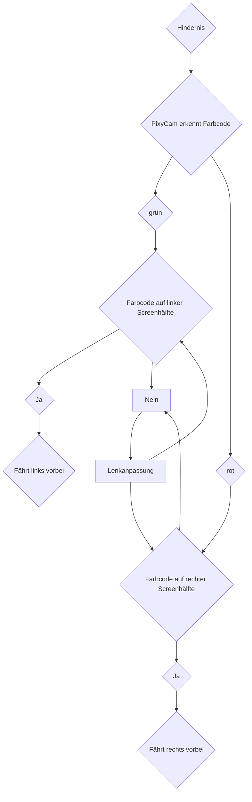

# Hindernisrennen
Hier wird unsere Programmstruktur für das Hindernisrennen besprochen. Besonders wird dabei das Kamera Programm eingegangen, welches die Daten derPixyCam verarbeitet. Außerdem wird die Gewichtung zwischen dem Ultraschall- und dem Pixy Cam Programm diskutiert.



```mermaid
graph LR
    subgraph Hindernis
        A((Hindernis))
        C((Farbcode))
        C1(Farbcode links)
        C2(Farbcode rechts)
    end

    subgraph Screenhälfte
        E(Screenhälfte links)
        F(Screenhälfte rechts)
    end

    subgraph Lenkanpassung
        L(Fährt rechts vorbei)
        R(Fährt links vorbei)
        Lenkanpassung((Lenkanpassung))
    end

    A -- PixyCam erkennt Farbcode --> C
    C -- grün --> E
    C -- rot --> F
    E --> C1
    F --> C2
    C1 -- Ja --> L
    C2 -- Ja --> R
    C1 -- Nein --> Lenkanpassung
    C2 -- Nein --> Lenkanpassung
    Lenkanpassung -- links --> C1
    Lenkanpassung -- rechts --> C2
    L --|Fährt links vorbei|A
    R --|Fährt rechts vorbei|A

```
