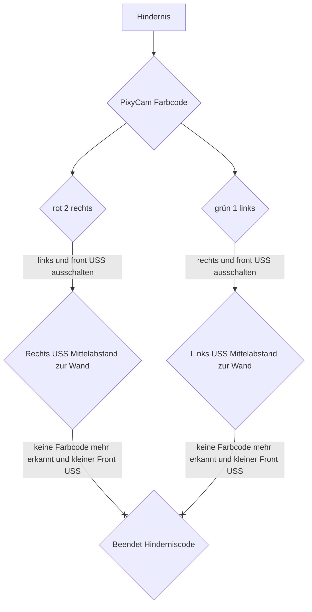

# Hindernisrennen

## Flowchart 

```mermaid
flowchart TB;
Hindernis --> P{PixyCam Farbcode} --> R{rot 2 rechts} & G{grün 1 links};
R -->|links und front USS ausschalten| RU{Rechts USS Mittelabstand zur Wand};
G -->|rechts und front USS ausschalten| LU{Links USS Mittelabstand zur Wand};
RU & LU --x |keine Farbcode mehr erkannt und kleiner Front USS | B{Beendet Hinderniscode};
```
