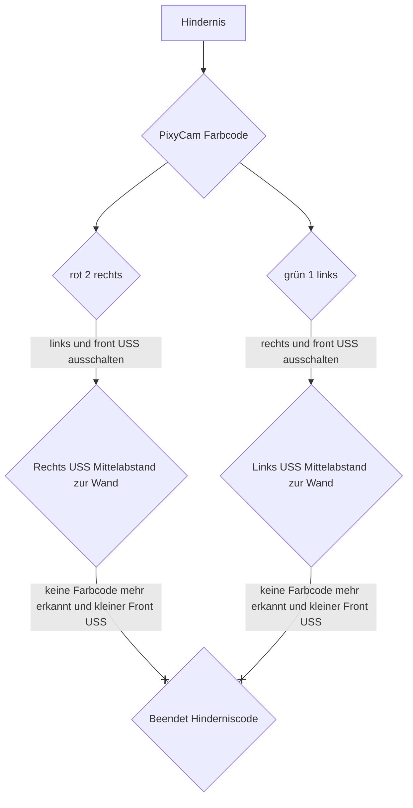

# Hindernisrennen

## Flowchart 

Beim Hindernisrennen nutzen wir die Eigenschaft der Pixy Cam, verschiedene Farbblöcke, für en Wettbewerb grün und rot, zu erkennen. Solange die PixyCam keine Farbblöcke registriert, ist die Variabel color=0 und das Hindernisrennenprogramm mit den Ultraschallsensoren läuft normal weiter ab. Sobald ein Farbblock erkannt wird, wird d color für grün auf 1 und für rot auf 2 gesetzt.
