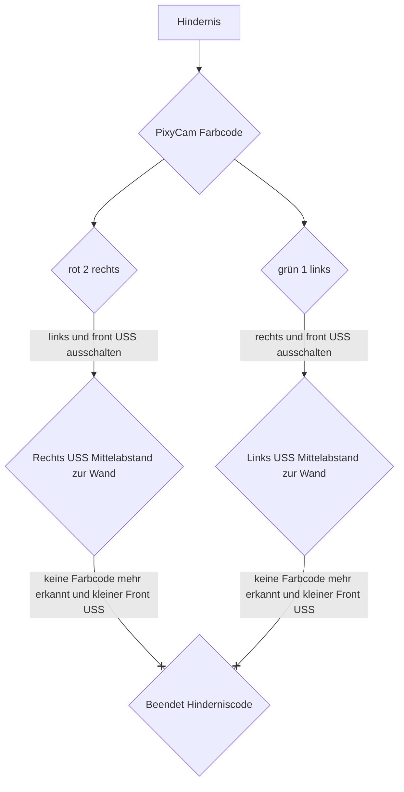

# Hindernisrennen

## Flowchart 

Beim Hindernisrennen nutzen wir die Eigenschaft der Pixy Cam, verschiedene Farbblöcke, für en Wettbewerb grün und rot, zu erkennen. Solange die PixyCam keine Farbblöcke registriert, ist die Variabel color=0 und das Hindernisrennenprogramm mit den Ultraschallsensoren läuft normal weiter ab. Sobald ein Farbblock erkannt wird, wird d color für grün auf 1 und für rot auf 2 gesetzt. Abhängig von color, wird für grün der rechte und für rot der linke Ultraschallsensor nicht weiter verwendet um nicht zu stören. Nun versucht das Auto, wie schon beim Eröffnungsrennen, einen rightshift zu berechnen und diesen einzulenekn um zwischen dem Block und der Wand mittig vorbeizufahren. Er verbleibt weiterhin in diesem Abstand, dh. nun auf einem Viertel und nicht der Hälfte der Strecke zwischen innerer und äußerer Begrenzung, bis er einen neuen Farbblock oder eine Kurve registriert.
