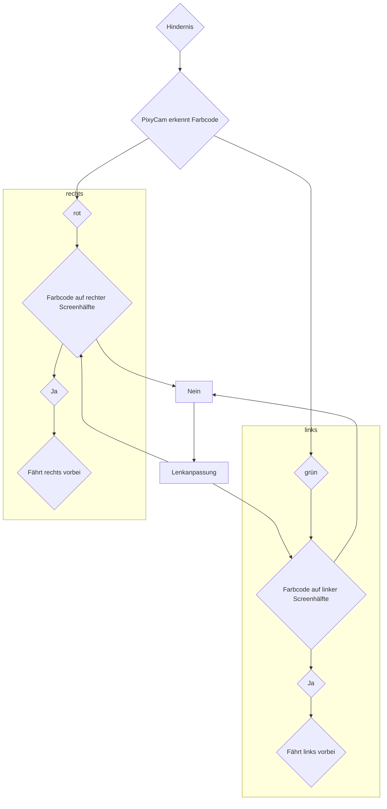

# Hindernisrennen
Hier wird unsere Programmstruktur für das Hindernisrennen besprochen. Besonders wird dabei das Kamera Programm eingegangen, welches die Daten derPixyCam verarbeitet. Außerdem wird die Gewichtung zwischen dem Ultraschall- und dem Pixy Cam Programm diskutiert.

