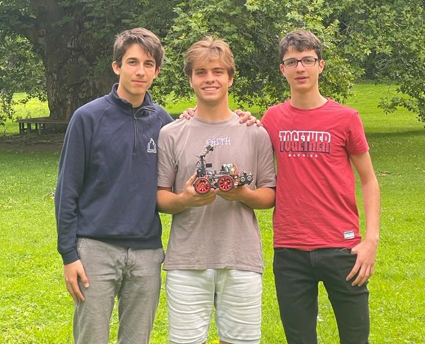

# PfortGT World Final Panama 2023 🤖

## Introduction
This is the GitHub repository for the autonomous driving car of the **PfortGT Team** of the **Landesschule Pforta from Germany** for the **WRO Future Engineers World Final 2023 in Panama**.
In this repository we go into our planning - and building process for our car. We describe our problems and ideas we had along the way and explain our construction plans and programs.
## Overview
Our car is powered by an Arduino. It consists of a chassis which is equipped with individually 3D-printed mounts for the various sensors and the camera (see [components](/vehicle/components)). Power is supplied by a rechargeable battery (see [electronics](/vehicle/electronics)). The sensor equipment consists of three ultrasonic sensors, a gyro sensor and a Pixy Cam2 (see [sensors](/vehicle/sensors)). For the Open Challenge, an Arduino code processes the distance to the walls measured by the ultrasonic sensors to make small steering adjustments to the car (see [Open Challenge](/programming/OpenChallenge)). In the Obstacle Challenge, in addition to the ultrasonic sensor code, a camera script is also used (see [Obstacle Challenge](/programming/ObstacleChallenge)). This looks for red and green color signatures via the Pixy Cam and keeps them on the screen section (right or left) corresponding respectively.
## Structure
Our repository is divided into several subgroups in which each topic of focus is discussed.
### Development
In [development](/development) we describe some short overviews of our development path with the ideas we had during the process, the problems we faced and how we solved them.
### Programming
In [programming](/programming) we explain the important part of coding. We describe and explain our structure, the decision for C++ and the two focal points [Open Challenge](/programming/OpenChallenge) and [Obstacle Challenge](/programming/ObstacleChallenge), as well as our actual [Overall Program](programming/OverallRace).
### Vehicle
In [vehicle](/vehicle/) it is shown in detail how our car is built. The [components](/vehicle/components) of the car are shown, how they are assembled and which of them were bought or 3D-printed. In [electronics](/vehicle/electronics) we explain the wiring and discuss the regulation of the the power supply for the motors and sensors. Besides that we discuss the [motors](/vehicle/motors) the car is equipped with and the motivation behinde our decission. Furthermore, our used [sensors](/vehicle/sensors), their special feautures and their purposes are explained. Additionally, [3D printing](/vehicle/3Dprinting) lists our files and work for our printed parts.
### Pictures
In [pictures](/pictures) there are photos of the car from different angles as well as our team photo. 
### Performance videos
In [videos](/videos) Youtube links are deposited, which demonstrate the performance of our car in test tracks for the various tasks.
### Quellen
In [sources](/sources) we document our sources of information. In addition, all [purchases](/sources/purchases) we have made for the additional components and the installation paths with the associated setup instructions for the software we use are stored.

