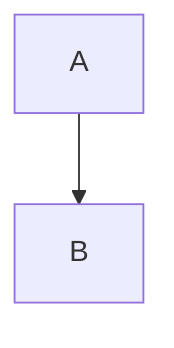

# PfortGT-WRO

## Enleitung
Dies ist das GitHub-repository für das autonom fahrende Auto des **PfortGT** Teams der **Landesschule Pforta** für den **WRO Future Engineers** Wettbewerb.
In diesem repository gehen wir auf unseren Planungs - und Bauprozess für unser Auto ein. Wir beschreiben unsere Probleme und  Ideen, welche wir auf dem Weg hatten und erläutern unser Baupläne und Programme.

## Überblick
Unser Auto wird durch einen Arduino und einen Raspberry Pi gesteuert (siehe [Hardware](/Roboterauto/Hardware)). Es besteht aus einem fertigen Chassi welches mit individuell 3D-gedruckten Halterungen für die verschiedenen Sensoren und die Kamera ausgestattet ist (siehe [Bauteile](/Roboterauto/Bauteile)). Die Stromversorgung läuft über einen Akku (siehe [Elektronik](/Roboterauto/Elektronik)). Das Sensorenequipment besteht aus drei Ultraschall-Sensoren, einem Gyro-Sensor und einer Pixy Cam2 (siehe [Sensoren](/Roboterauto/Sensoren)). Für das Eröffnungsrennen verarbeitet ein Arduino Code den durch die Ultraschall-Sensoren gemessenen Abstand zu den Wänden, um kleine Lenkanpassugen des Autos zu treffen (siehe [Eröffnungsrennen](/Programme/Eröffnungsrennen)). Beim Hindernisrennen wird neben dem Ultraschall-Sensoren Code auch ein Kamera Script verwendet (siehe [Hindernisrennen](/Programme/Hindernisrennen)). Dieses sucht über die Pixy Cam nach roten und grünen Farbsignaturen und hält diese auf dem Bildschirmabschnitt (rechts oder links), welcher dem jeweiligen Abbiegen des Autos entspricht.
## Aufbau

Unser Repository ist in mehrere Untergruppen aufgeteilt, in welchem die einzelnen Schwerpunkte besprochen werden.
### Entwicklung
In [Entwicklung](/Entwicklung) beschreiben wir unseren Entwicklungsweg. Dabei gehen wir auf unsere Ideen ein, die wir währendessen hatten, Probleme welche uns beschäftigten und wie wir sie gelöst haben. Zum Schluss beleuchten wir kurz neue Probleme mit welchem wir uns noch auseinandersetzten und unsere zukünftigen Verbesserungen und Ideen für dieses Projekt.
### Programme
In [Programme](/Programme) erläutern wir das Herzstück dieses Wettbewerbs, das Coding. Wir beschreiben und erklären dabei unsere Gliederung, die Entscheidung für C++ und die drei Schwerpunkte [Motorkontrolle](Programme/Motorkontrolle), [Eröffnunggsrennen](Programme/Eröffnungsrennen) und [Hindernisrennen](Programme/Hindernisrennen).
### Roboterauto
In [Roboterauto](/Roboterauto/)

