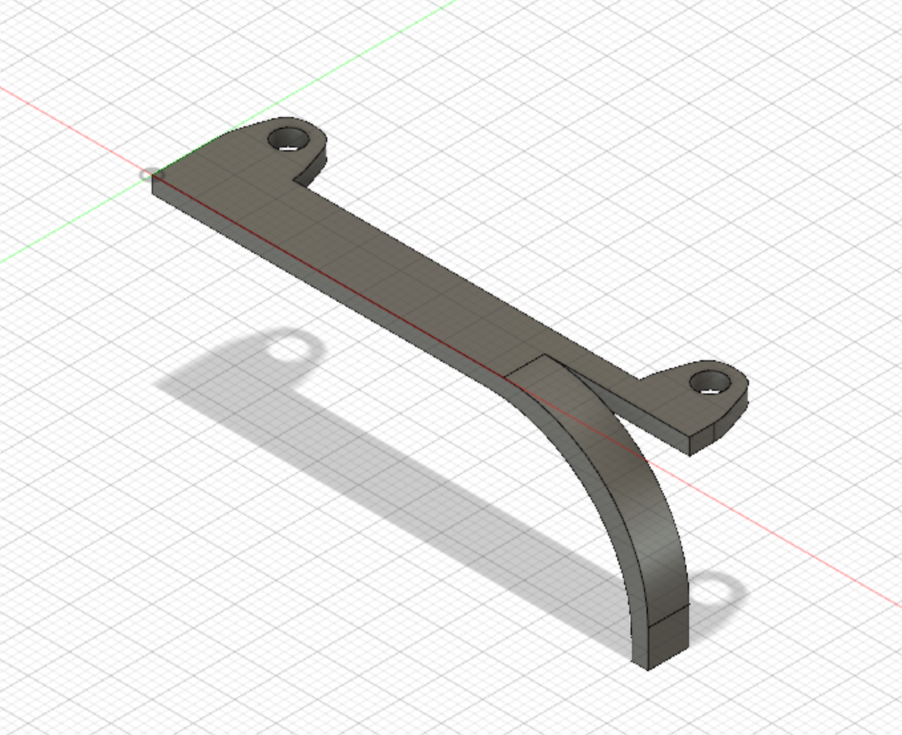

# Bauteile
Hier wird der Aufbau des Autos und die 3D gedruckten Halterungen besprochen

## Chassis
Zuerst wurde mit der Planung des Chassis begonnen (siehe Entwicklung). Das momentane Chassis besteht aus einer großen metallischen Grundplatte, an welcher die Lenkung, der Motor mit dem Getriebe, die Achsen und die restliche Hardware befestigt sind. Da uns dieses fertige Chassis zusammen mit vier Rädern zugeschickt wurde und die Zeit bis zum Wettkampf knapp war, musste mit dem Einbau der Sensoren, der Kamera und der restlichen Technik begonnen werden.

## Sensorengrundplatte
Die Ultraschallsensoren sollten möglichst weit vorne am Roboter befestigt werden, um möglichst früh auf die kommenden Hindernisse oder Bahnänderungen reagieren zu können. Um dieses dementsprechend zu befestigen, wurde eine Sensorengrundplatte designed, welche den Anforderungen gerecht wird:

  

Die Löcher sind so angeordnet, dass drei Sensorenhalterungen mit je zwei Löchern, vier Löcher für den Kameraturm und vier für den Anbau an das Chassis zur Verfügung stehen. 
Im Folgenden ist noch ein Bild des Bauteils am Roboter zu sehen:

  
Der Kameraturm wurde später noch weiter nach hinten auf das Auto gebaut. -> siehe Entwicklung und Kameraturm.

# Ultraschall-Sensorenhalterung
Die Sensorenhalterung musste die Ultraschall-Sensoren statisch und gegenüber bzw. rechtwinklig zueinander befestigen, um vertrauenswürdige, reproduzierbar signifikante Messwerte zu erhalten. Daher ist die Genauigkeit der Befestigung entscheidend. Zwei große Löcher dienen als Halterung für den Sender und Empfänger des Ultraschall-Sensors, die vier Löcher drum herum dienen der Befestigung des Sensors an der Halterung.

  
Durch diese werden kleine Pins oder Drähte geschoben, welche auf der anderen Seite eingeschmolzen oder umgebogen werden können. Zwischen Halterung und Sensor werden noch die Abstandshalter eingebaut, um eine möglichst feste Verbindung zu schaffen, damit kein Spielraum entsteht und die Sensoren unnötig wackeln. Über die zwei Löcher auf der Bodenseite ist die Halterung an der Grundplatte verschraubt (siehe Sensorengrundplatte).
  

  
## Abstandshalter
Die Abstandshalter werden benötigt, um verschiedene Kontakte zu isolieren bzw. eine Erdung zu verhindern und um Abstände zwischen verschiedenen Bauteilen auf eine länge zu beschränken. Die Template, welche gedruckt wurde, enthält Abstandshalter mit einer Höhe von 2.5mm und 5.0 mm, um verschiedene Abstände zu erstellen. Der Innenradius beträgt 3.5mm, sodass die Schrauben, welche hauptsächlich verwendet wurden, genau so passen, dass Widerstand besteht, man die schrauben aber durchschauen kann. Die Abstandshalter sind also auch als Muttern verwendbar.
  

## Befestigungspins

Die Befestigungspins bestehen aus kleinen Plastik-Stäben und einem Kopf. Die Stäbe schiebt man durch Befestigungslöcher, bis der Kopf auf Anschlag an der Befestigung befindet.
Danach kann man das andere Ende kurz erwärmen und dann umbiegen. So hat man eine statische, präzise Lösung, um die Sensoren an den Halterungen zu befestigen. Für Testfahrten wurden jedoch noch Kabel statt den Pins benutzt, weil diese nicht so schnell kaputt gehen. Der Nachteil von Kabeln bzw Drähten besteht darin, dass man diese nicht so eng befestigen kann, weshalb mehr Spielraum entsteht.

## Kameraturm

Die Kamera sollte sich möglichst hoch auf dem Auto befinden (siehe Quellen: p04-cv.md), des Weiteren möglichst weit hinten, um eine große Übersicht zu gewährleiste, Hindernisse möglichst lange detektieren und Hindernisse hintereinander in Bezug auf die Nähe unterscheiden zu können. Daher hat sich ein Kameraturm entwickelt, auf welchen später die Kamera mit den Kamera-Winkelhaltern geschraubt wird:

 

Die Dreiecke in dem Turm wurden eingefügt, um Material zu sparen und möglicherweise in der Zukunft jegliche Bauteile grob zu befestigen.

## Kamerawinkelhalter

Der Winkelhalter befestigt die Halterung der Kamera an dem Kameraturm. Benötigt wurde dieser, weil die mit der Kamera gelieferten Winkel ein Gewinde hatten und dadurch nicht mit unseren Schrauben kompatibel waren. Da aber die Kamera kippbar sein soll, was mit dem gelieferten 	Set-Up nicht möglich ist, hilft der gedruckte Winkelhalter, um die Kamera auf ein Podest mit den Abstandhaltern zu bringen und diese drehbar zu machen.

  
  

## Zahnradschutz

Der Zahnradschutz ist ein Bauteil, welches verhindert, dass jegliche Kabel in die Nähe von den Zahnrädern kommen:

  
  

