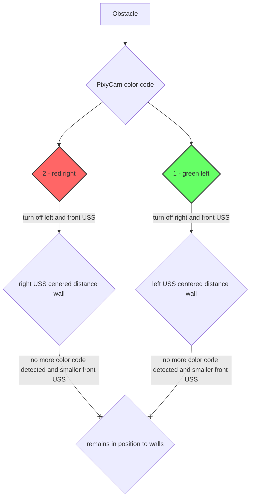

# Development

First, the chassis was planned. It was important to keep the turning radius as small as possible and therefore the car short, while the steering, the motor and all other hardware components needed to fit on it. So the following first sketch (1:1) was made:

  

Now the type steering system had to be considered. The standard solution is an Ackermann steering mechanism, which works mechanically pretty well, but is hard to construct. In the following image, our first schematic scetch is seen, which helped us understandung the orinciples of the Ackermann steering mechanism.

The Rack and Pinion system is a more intuitive solution, which often does not work as good as the first one. Furthermore the lengths and dimensions of the steering knuckle and the tie-rod are important for preventing that the rear axle could break out. We developed a graphical calculation system using GeoGebra (which can be found in uploaded files/development) for determining fitting parameters. 

At the same time, we received the Funduino set, whose steering system we immediately adopted because it met our requirements. Instead we concentrated on minimizing the car dimensions and with that the turn radius and the chance of hitting obstacles.
We then printed more and more parts and were able to replace most of the parts with ours and also add additional components, such as the camera tower, which later had to be moved to the rear to ensure a better view. This helped to have a longer correction time and a better evaluation of the obstacle's position. 

This is our first attempt of placing the camera tower:

(For understanding how each components were designed and built, have a look at [components](https://github.com/SchroedingersBit/PfortGTPanama/tree/main/vehicle/components).

A crucial change is also the exchange of the two gears, so that instead of a large to small transmission, there is a small to large transmission. Therefore, the car drives slower, but has a greater torque and does not stop at low speeds, thus overcoming greater static friction forces / rolling friction forces. This was needed since it often slowed down during steering to a minimum speed risking to stop and not being able to continue its drive. A greater torque and a lower speed also provides more time for calculating the new steering correction.
Another important step for increasing the time and power of computing was replacing the Arduino Uno with the Arduino Mega.

## Old Obstacle program 
After our tournamet in germany, we decided to change the logic in our Obstacle challenge program, because the robot had problems with driving curves and detecting blocks right behind them. Here is our old Flowchart:

We now decided to reduce the influences of all Ultrasonic sensors and calculate a steering angel, the camera shift, only through location of the block in the camera frame.
 
