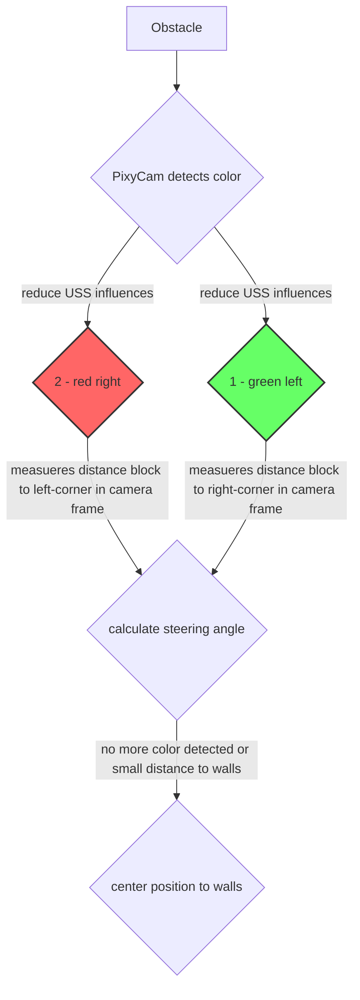

# Obstacle Challenge

In the obstacle race, we use the property of the Pixy Cam to detect different color blocks, green and red for the competition. As long as the PixyCam does not register any color blocks, the variable color=0 and the program continues to run normally, without any disctractions from the camera. As soon as a color block is detected, color is set to 1 for green and 2 for red. The influence of the ultrasonic sensors on the steering is now reduced in order to concentrate on the steering inputs from the camera. If the car exceeds a threshold value for the distance to the walls, a steering adjustment is made to center it again.  A new steering angle - camera shift - is calculated using the distance between the block and the edge of the camera frame.  The further to the left a red block is in the frame, for example, the smaller the steering adjustment. A short timer has been built in to prevent the car from shifting the block when driving around it due to the next steering adjustments, as the camera can no longer see it.

## Flowchart

