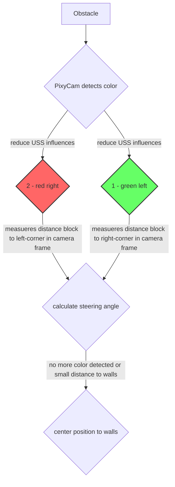
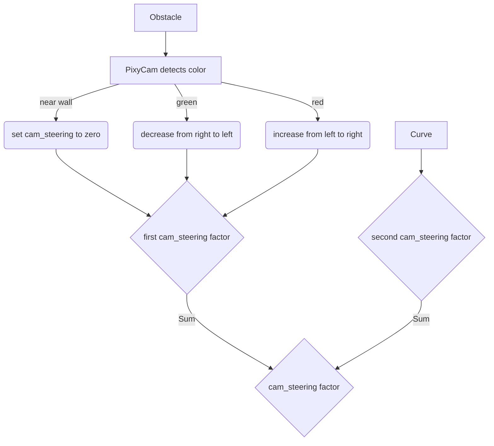
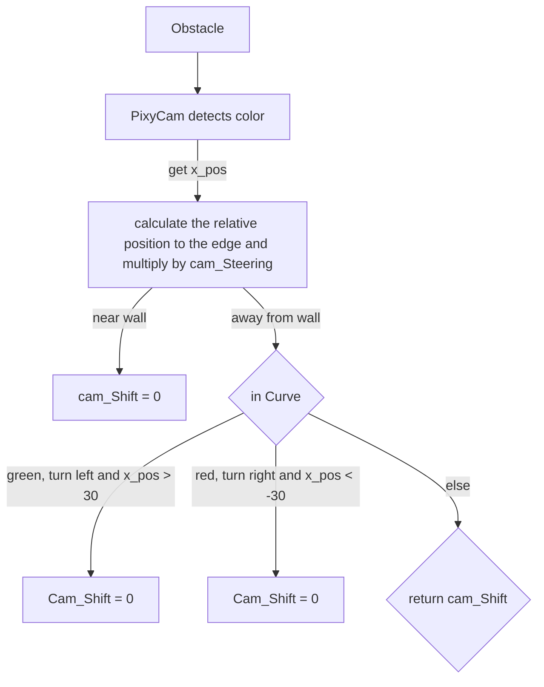

# Obstacle Challenge

In the obstacle race, we use the property of the Pixy Cam to detect different color blocks, green and red for the competition. As long as the PixyCam does not register any color blocks, the variable color=0 and the program continues to run normally, without any disctractions from the camera. As soon as a color block is detected, color is set to 1 for green and 2 for red. The influence of the ultrasonic sensors on the steering is now reduced in order to concentrate on the steering inputs from the camera. If the car exceeds a threshold value for the distance to the walls, a steering adjustment is made to center it again.  A new steering angle - camera shift - is calculated using the distance between the block and the edge of the camera frame.  The further to the left a red block is in the frame, for example, the smaller the steering adjustment. A short timer has been built in to prevent the car from shifting the block when driving around it due to the next steering adjustments, as the camera can no longer see it.

## Overview

## Cam_Steering
The steering of the vehicle should decrease when the block is further and further to the left or right of the camera, depending on the color. To ensure this, we let the cam_steering_factor decrease linearly. And then we let the steering_factor become zero when it is close to the wall. It is important that we let the factor increase when the car is in a curve so that the car can avoid the obstacle. The Cam_steering factor is then multiplied to the cam_Shift variable.

And here you can see the linear functions which rose from this function $$f(color, x_{pos}) = \frac{(1.4 - 0.4)}{(2 * frameWidth)} * (2 * color - 3) * x_{pos} + \frac{(1.4 + 0.4)}{2}$$.
<table align="center">
  <tr>
    <td align="center">
      
      
color = 1

    </td>
    <td align="center">
      
      
color = 2 

    </td>
  </tr>
</table>

## Cam_Shift
In our code we calculate the position of the Block to its corresponding edge with this formula $$frameWidth * (3 * \min(1, color) - 2 * color) - x_{pos}$$. Furthermore this function is then multiplied by cam_Steering to strongen or weaken the effect of the cam_Shift. There is still more parameters that are multiplied with cam_Shift to ensure a safe drive.

