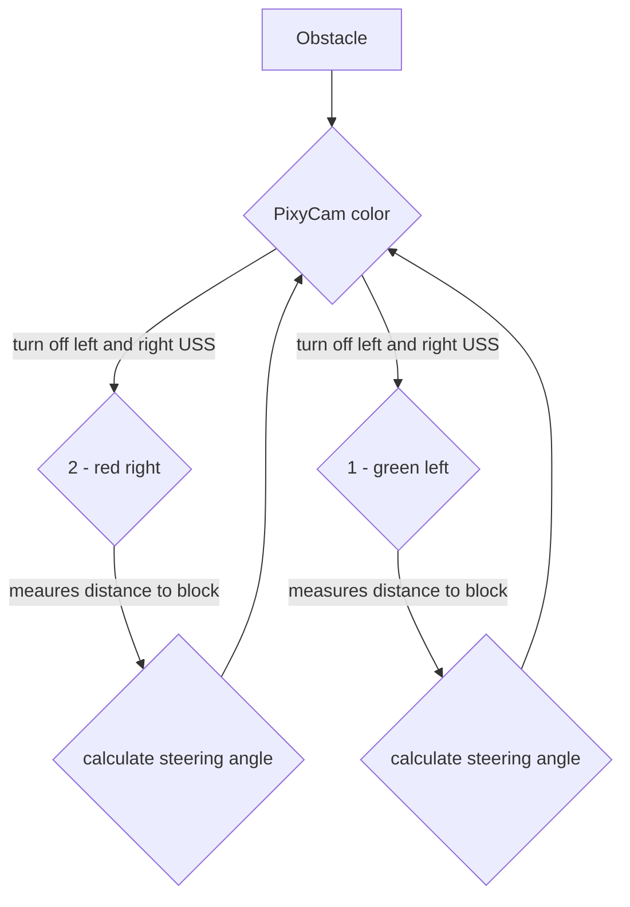
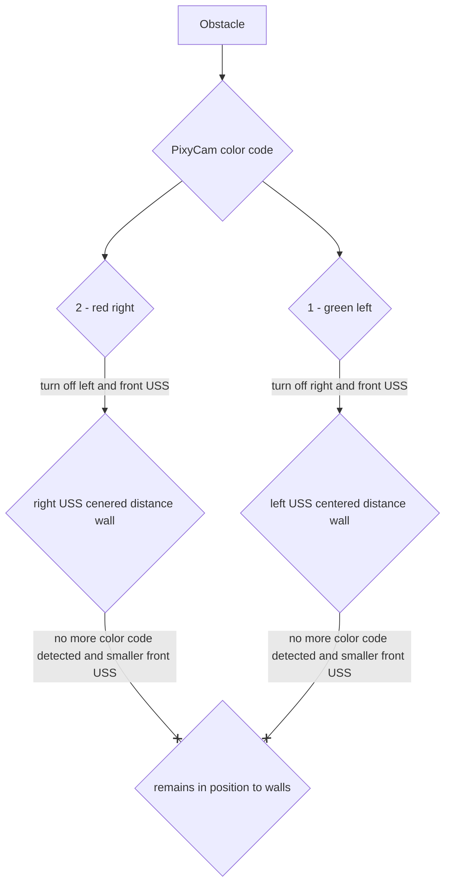

# Obstacle Challenge

In the obstacle race, we use the property of the Pixy Cam to detect different color blocks, green and red for the competition. As long as the PixyCam does not register any color blocks, the variable color=0 and the program continues to run normally, without any disctractions from the camera. As soon as a color block is detected, color is set to 1 for green and 2 for red. Depending on color, the right ultrasonic sensor is not used for green and the left ultrasonic sensor for red in order not to disturb. Now, as in the opening race, the car tries to calculate a rightshift and to retract it in order to pass between the block and the wall in the middle. It continues to stay at this distance, which is now a quarter and not half of the distance between the inner and outer boundary, until it registers a new color block or a turn.

## New programm Flowchart

## Old programm Flowchart 

