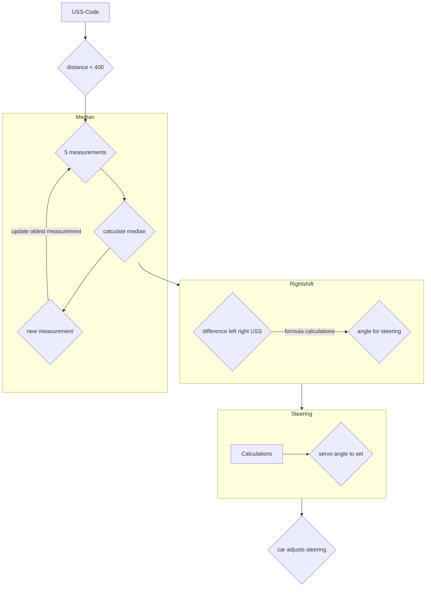

# Open Challenge
In the opening race, the car incorporates ultrasonic and gyroscope sensor data in order to be able to drive in the center between the set-up boundaries. If it is not in the center, e.g. because of a curve or inaccuracies, a new angle - target angle from the different distances to the walls - rightshift is calculated, which should be aimed at. This angle is then slowly corrected to prevent a jerky movement and must not exceed a maximum size, which is defined by the gyro sensor. The gyro sensor also counts the covered curves to stop after three rounds. The ultrasonic sensor value results from the median of 5 measurements and is updated all the time.
## Flowchart for the ultrasonic sensors

## Flowchart for curve logic

