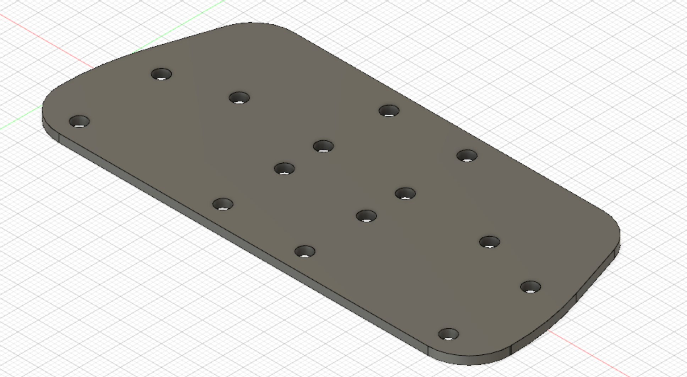
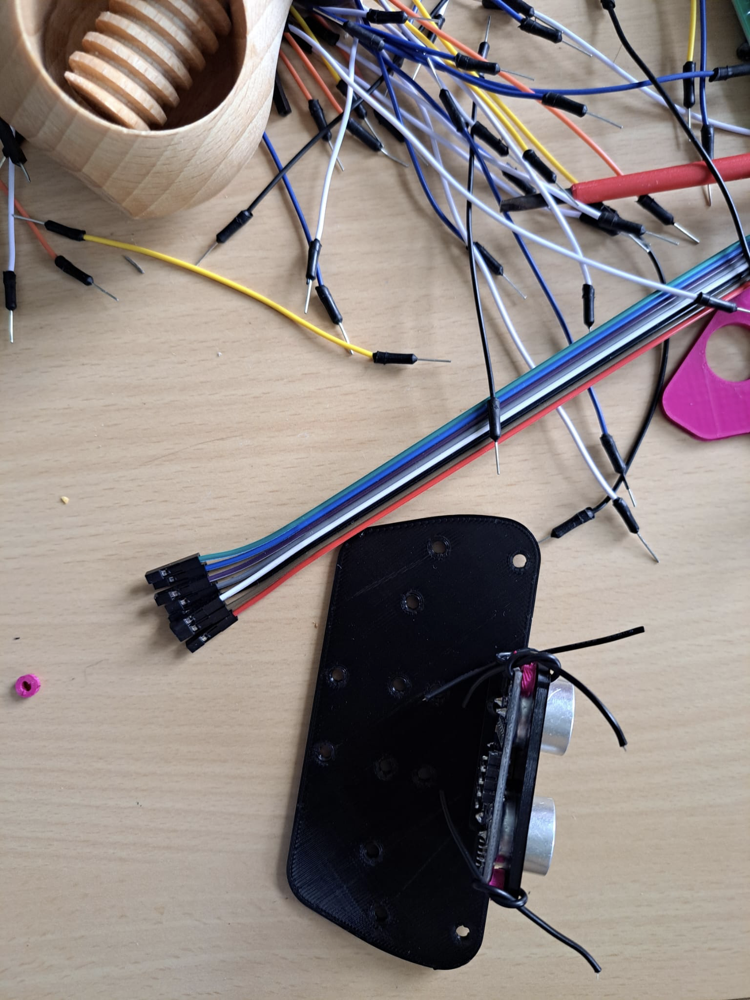
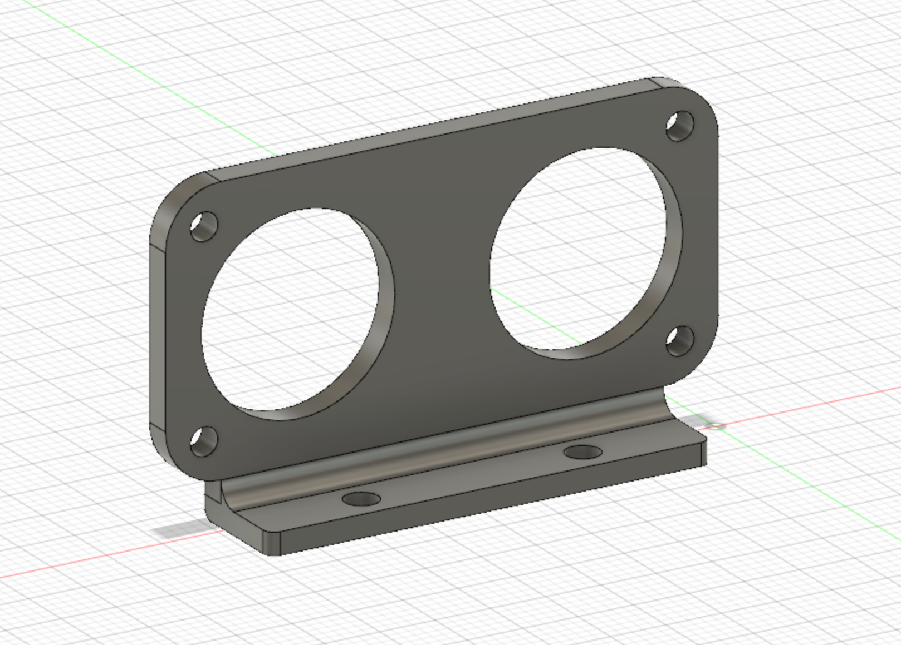
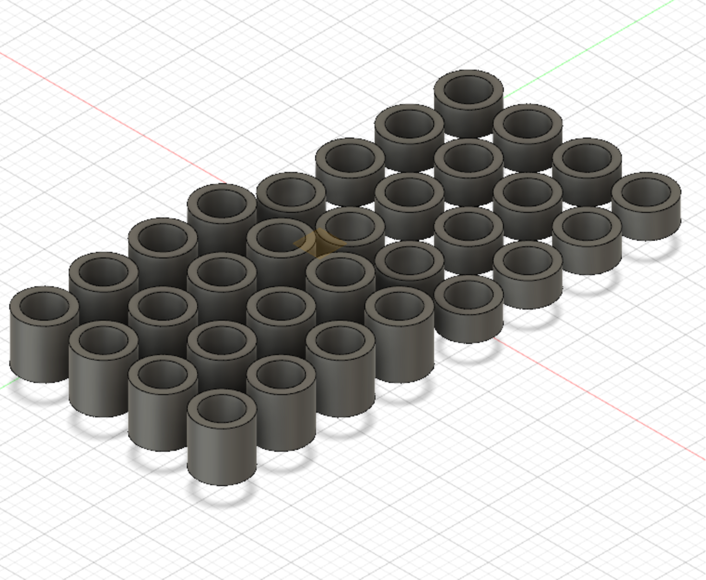
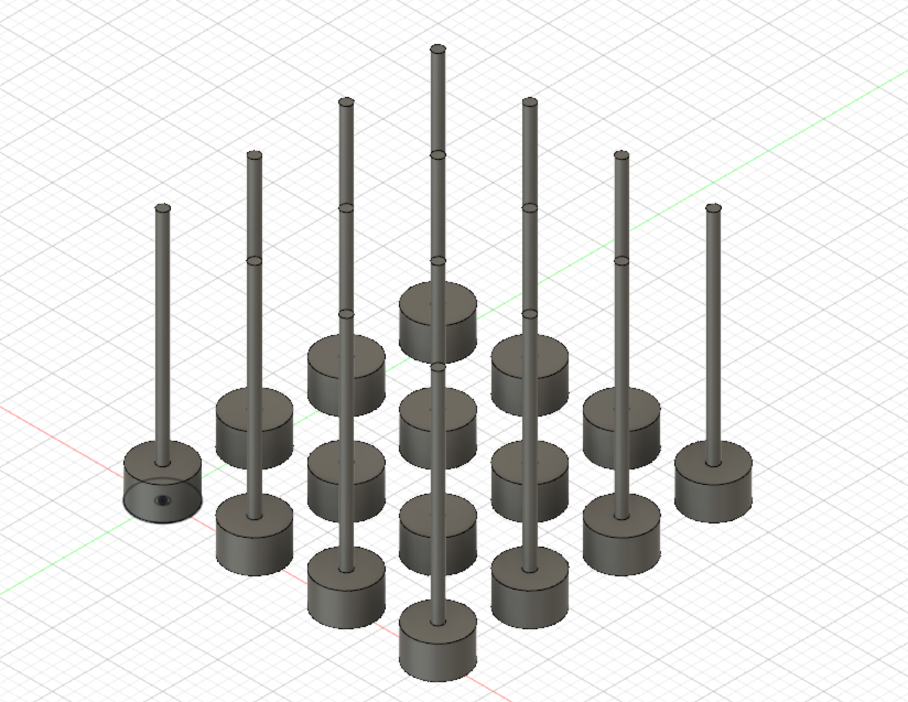
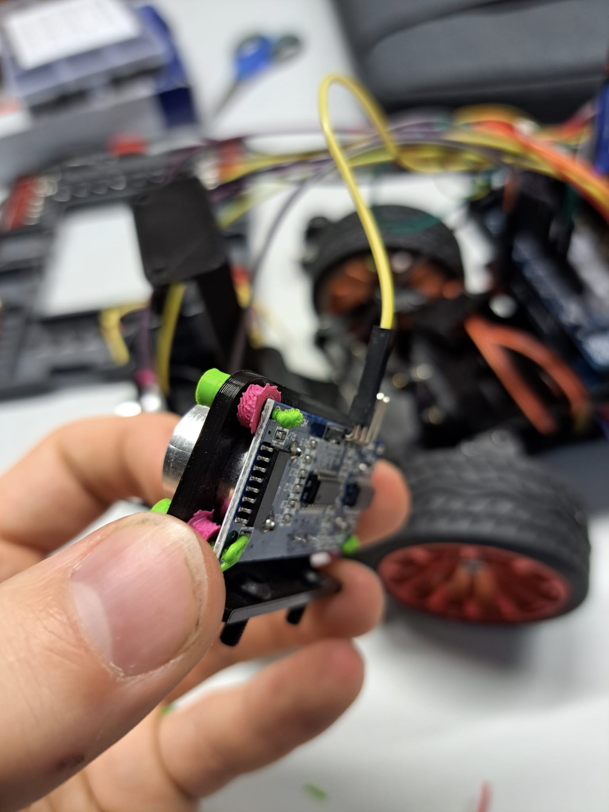
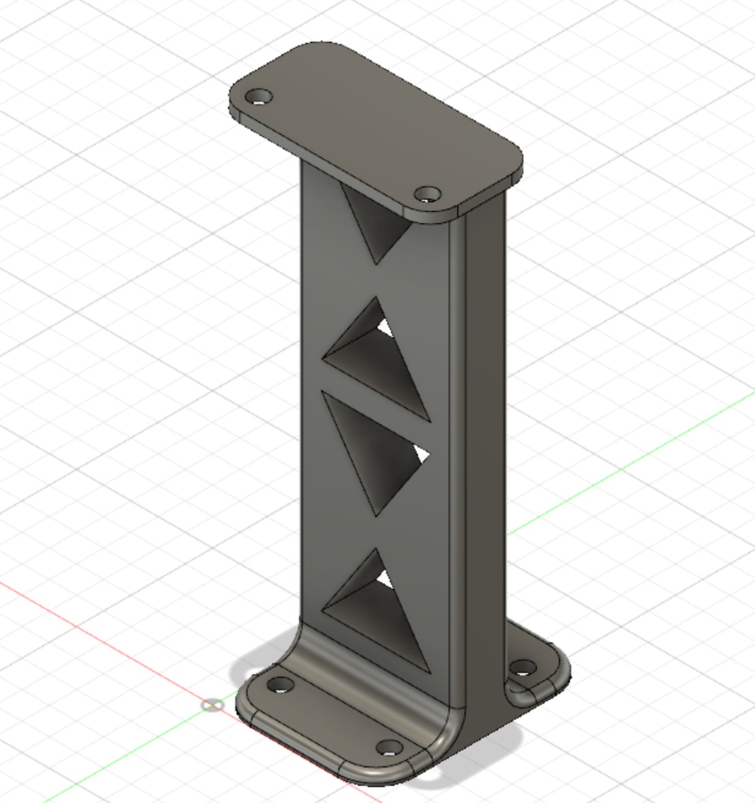
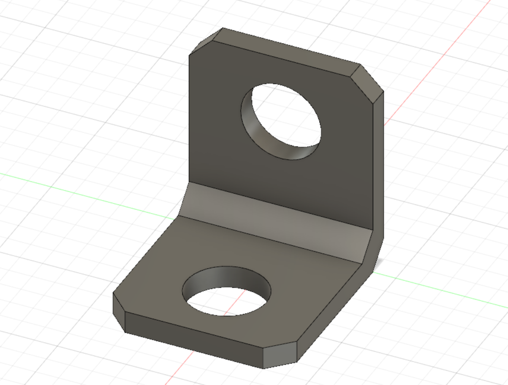
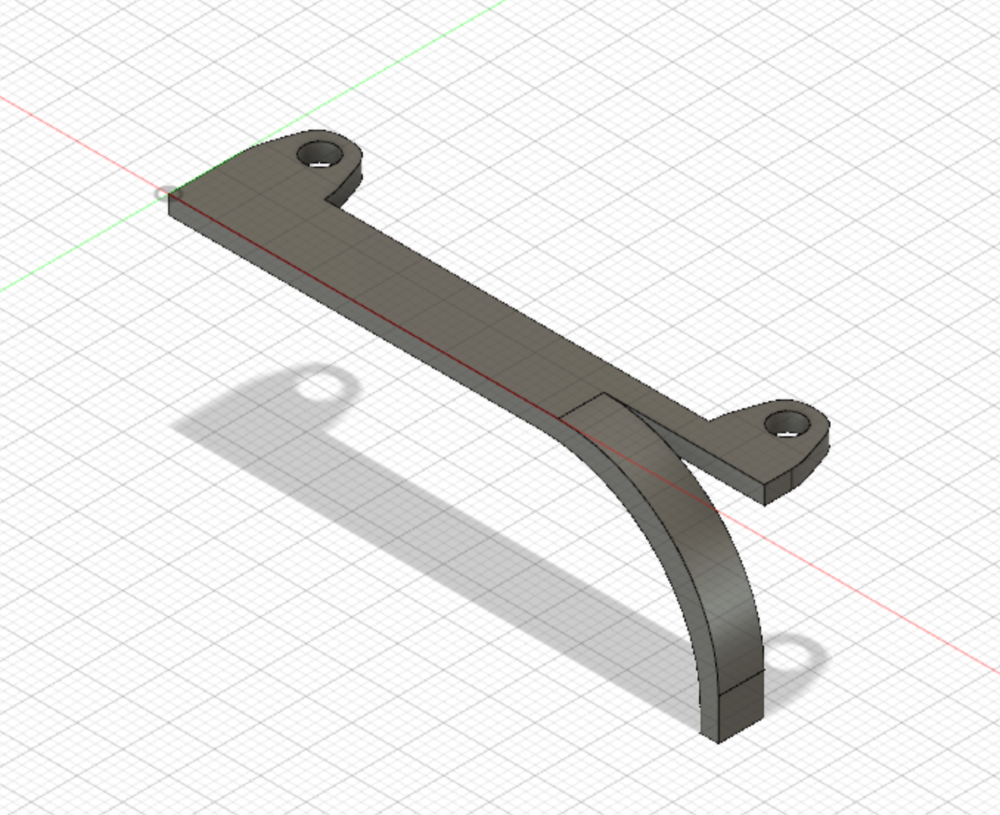

# Components
Here we discuss the construction of the car and the 3D printed brackets

## Chassis
First, the planning of the chassis was started (see development). The current chassis consists of a large 3D-printed base plate to which the steering, the motor with the gearbox, the axles and the rest of the hardware are attached. The main requirements for the base plate are to shorten it compared to the previous base plate (Δl= -5cm) and to provide enough mounting options for the rest of the hardware. This resulted in the following design (only half of it can be seen because it was then later mirrored so that a complete plate is created).

Printed and screwed together with the first further components it looks like this:

The cover plate is placed on this base plate, on which the Arduino, the camera tower and the controller are located. Particular attention should be paid to the holes in the middle, which facilitate cable management:

## Sensor base plate
The ultrasonic sensors should be mounted as far forward as possible on the robot in order to be able to react as early as possible to the coming obstacles or path changes. In order to mount this accordingly, a sensor base plate was designed that meets the requirements:

  

The holes are arranged to provide three sensor mounts with two holes each, four holes for the camera tower, and four for mounting to the chassis. 
Below is another picture of the component on the robot:

  
  

The camera tower was later built even further back on the car. -> see development and camera tower.

# Ultrasonic sensor mount
The sensor mounting had to mount the ultrasonic sensors statically and opposite or perpendicular to each other in order to obtain trustworthy, reproducibly significant measured values. Therefore, the accuracy of the mounting is critical. Two large holes are used to hold the ultrasonic sensor transmitter and receiver, and the four holes around them are used to attach the sensor to the mount.

  

Small pins or wires are pushed through these, which can be melted or bent over on the other side. Between the holder and the sensor, the spacers are installed to create as tight a connection as possible, so that there is no play and the sensors wobble unnecessarily. The holder is screwed to the base plate via the two holes on the bottom side (see sensor base plate).
  

  
  

  
## Spacer
The spacers are needed to isolate or prevent grounding of different contacts and to limit distances between different components to one length. The template that was printed contains spacers with a height of 2.5mm and 5.0 mm to create different distances. The inner radius is 3.5mm so that the screws, which were mainly used, fit exactly so that there is resistance but you can screw the screws through. So the spacers can also be used as nuts.

  

  
  

## Fixing pins

The fixing pins consist of small plastic rods and a head. The rods are pushed through the mounting holes until the head is in contact with the mounting.
Then you can heat the other end briefly and then bend it over. This gives you a static, precise solution for attaching the sensors to the mounts. For test drives, however, cables were still used instead of the pins because they don't break as quickly. The disadvantage of cables or wires is that you can't attach them as tightly, which is why there is more slack.

  
  

## Camera tower

The camera should be located as high as possible on the car (see [Camera Mounting Future Engineers Docs](https://github.com/World-Robot-Olympiad-Association/future-engineers-gs/blob/main/docs/p04-cv.md)), furthermore as far back as possible to ensure a large overview, to be able to detect obstacles as long as possible and to distinguish obstacles behind each other in terms of proximity. Therefore a camera tower was developed, on which later the camera with the camera angle holders is screwed:

  
  

The triangles in the tower were inserted to save material and possibly roughly attach any components in the future.

## Camera angle holders

The angle holder attaches the mount of the camera to the camera tower. This was needed because the angles supplied with the camera had a thread and were therefore not compatible with our screws. But since the camera is supposed to be tiltable, which is not possible with the supplied setup, the printed angle holders helps to put the camera on a pedestal with the spacers and make them rotatable.

  
  

## Gear protection

The gear protection is a component that prevents any cables from getting near the gears:

  
  

## Gearbox
Conversion to small to large.

  

## Battery holder

Die eleganteste Lösung schien es zu sein, den Akku hinten am Auto zu befestigen. Dafür haben wir eine Akkubox entwurfen, in welche man den Akku legen kann. Er besteht aus zwei Teilen (siehe 3D-Modelle), dem A und B Teil, welche als Einzelteile gedruckt und dann verklebt werden. Dadurch erhält man einen genaueren Druck, weil dadurch keine Druckstützen benötigt wurden. Im folgenden sind Bilder von den Einzelnen Designs zu sehen und von dem fertigen Bauteil:

